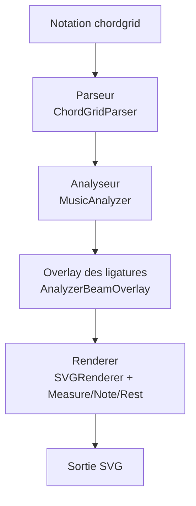

# Plugin Chord Grid pour Obsidian

[English](./README.md)

> Affiche des grilles d'accords avec une notation rythmique précise, rendue en SVG net et scalable dans vos notes Obsidian.

**Version :** 2.0.0 · **Licence :** GPL-3.0 · **Statut :** Stable

## Installation

1. Créez un dossier `chord-grid` dans `.obsidian/plugins/`
2. Copiez les fichiers suivants dans ce dossier :
   - `main.ts` (code du plugin)
   - `manifest.json`
3. Compilez le TypeScript : `npm run build` (voir section Développement)
4. Activez le plugin dans Obsidian : Réglages → Plugins communautaires

## Utilisation

Dans vos notes Obsidian, créez un bloc de code avec la langue `chordgrid` :

````markdown
```chordgrid
4/4 ||: Am[88 4 4 88] | C[88 4 4 88] :||
```
````


### Syntaxe

**Indication de mesure :** `4/4`, `3/4`, `6/8`, `12/8`, etc.

**Barres de mesure :**
- `|` : barre simple
- `||` : double barre fin de grille
- `||:` : début de reprise
- `:||` : fin de reprise

**Accords :** Notation standard (`Am`, `C`, `Gmaj7`, `Dm`, `F#m`, `Bb7`, `C/E` ...)

**Rythme entre crochets (valeurs de notes) :**
- `1` = ronde
- `2` = blanche
- `4` = noire
- `8` = croche
- `16` = double-croche
- `32` = triple-croche
- `64` = quadruple-croche

**Silences :** Préfixer par `-` :
- `-1` = pause
- `-2` = demi-pause
- `-4` = soupir
- `-8` = demi-soupir
- `-16` = quart de soupir
- `-32` = trente-deuxième de soupir
- `-64` = soixante-quatrième de soupir

Exemple : `C[4 -4 88_4]` = noire, soupir de noire, deux croches avec la dernière croche liée à la dernière noire.


> Les silences coupent les groupes de ligatures. Exemple : `[88-88]` produit deux groupes distincts.

**Groupement rythmique :**
- Les nombres collés décrivent un battement groupé (ex: `88` = 2 croches liées)
- Les espaces séparent les groupes de ligature
- Le point `.` crée une note pointée (`4.` noire pointée, `8.` croche pointée)
- Le `_` crée une liaison (tie). Exemple : `[88_4]` lie la dernière croche au début de la noire suivante
- On peut lier à travers une barre de mesure : `C[2 4_88_] | [_8]`

Rappel :
- `_` en fin ou début de groupe permet de lier vers/depuis la mesure suivante
- Un espace entre deux segments d'accord coupe une ligature, même sans changement d'accord
- Les notes pointées influencent la direction des beamlets (demi-ligatures)

#### Glossaire (référence rapide)
| Terme | Signification |
|------|----------------|
| Battement (Beat) | Unité de pulsation logique dans la mesure |
| Ligature (Beam) | Barre horizontale reliant des hampes de notes courtes (≥ croches) |
| Demi-ligature (Beamlet) | Petit tronçon de ligature pour notes isolées |
| Liaison (Tie) | Courbe prolongeant la durée sur la note suivante |
| Silence (Rest) | Durée sans son |
| Segment | Portion de mesure associée à un accord |
| Note pointée | Note avec `.` augmentant la durée de 50% |

#### Points de syntaxe avancés
| Modèle | Effet |
|--------|-------|
| `88` | Deux croches liées (même battement) |
| `8 8` | Deux croches séparées (espace coupe la ligature) |
| `4.` | Noire pointée (= noire + croche) |
| `16.32` | Direction des demi-ligatures adaptée (chemin analyseur) |
| `4_88_ | [_8]` | Liaison à travers la barre de mesure |
| `C[8]G[8]` | Ligature inter-segments si aucun espace (analyseur) |
| `C[8] G[8]` | Espace = ligature cassée |

### Exemples

**Mesure simple 4/4 :**
```chordgrid
4/4 | G[4 4 4 4] |
```

**Grille avec reprises :**
```chordgrid
4/4 ||: Am[88 4 4 88] | Dm[2 4 4] | G[4 4 2] | C[1] :||
```

**Rythmes variés :**
```chordgrid
4/4 | C[8888 4 4] | G[4 88 4 8] |
```

**Lignes multiples :**
```chordgrid
4/4 ||: C[4 4 4 4] | F[4 4 4 4] | G[4 4 4 4] | C[2 2] |
    Am[88 88 4 4] | Dm[4 4 2] | G7[16161616 4 4] | C[1] :||
```

**Notes pointées :**
```chordgrid
4/4 | C[4. 8 4 4] | D[8.16 88 4. 8] | Em[168. 4 4 88] | C[16816 4 16168 81616] |
```

**Silences :**
```chordgrid
4/4 | C[4 -4 4 4] | G[-2 4 4] | Am[88 -8 8 4] | F[4 4 -2] |
```

**Liaisons (ties) :**
```chordgrid
4/4 | C[2 4_88_] | [_8] G[8 4 4 4] | Am[88_4 4 88_] | [_4] Dm[2.] | C[4 4 4_88_] | [_88 4] D[4 4] |
```

**Attention aux espaces avant un accord :**
```chordgrid
[_8] G[8 4 4 4]
```
Différent de :
```chordgrid
[_8]G[8 4 4 4]
```
L'espace avant `G` casse la ligature.

### Dépannage
| Symptôme | Cause possible | Correctif |
|---------|-----------------|-----------|
| Mesure invalide | Somme ≠ signature rythmique | Recompter; une note pointée ajoute 50% |
| Ligature coupée | Présence d'un espace ou d'un silence | Retirer l'espace / vérifier absence de `-` |
| Liaison absente entre lignes | Résolution en attente dans TieManager | Mettre `_` en fin et début de groupe |
| Pas de panneau Debug | Plugin désactivé ou logger masqué | Réactiver le plugin; vérifier paramètres |

### Fonctionnalités

- ✅ Rendu SVG vectoriel
- ✅ Grilles d'accords avec notation rythmique
- ✅ Groupement automatique des croches par battement (chemin legacy)
- ✅ Barres de reprise & types de barres
- ✅ Signatures rythmiques (simples & composées)
- ✅ 4 mesures par ligne (auto)
- ✅ Largeur de mesure dynamique
- ✅ Notes pointées, liaisons, silences
- ✅ **Logger de debug inline** (v1.1.0)
- ✅ **Rendu amélioré des ligatures complexes**
- 🚧 **Ligatures inter-segments via analyseur** (v2.0.0)
- 🚧 **Overlay de ligature basé sur analyse** (feature flag)
- 🚧 Prévu : tuplets, appoggiatures, articulations, dynamiques, export

### Limitations actuelles

- Overlay d'analyse expérimental (fallback legacy)
- Pas encore de dynamiques, articulations, appoggiatures, tuplets
- Pas d'export (PDF/PNG/MIDI) pour le moment
- Cas très complexes avec notes pointées + silences : décisions limitées en mode legacy

### Feuille de route (haut niveau)
| Jalon | Contenu |
|-------|---------|
| v1.x Maintenance | Stabilité, corrections, polissage de la doc |
| v2.0 Analyseur | Séparation Parser → Analyzer → Renderer, beaming unifié |
| v2.1 Tuplets & appoggiatures | Extension du modèle de durée |
| v2.2 Dynamiques & articulations | Calque de symboles, décorateurs de rendu |
| v2.3 Export | Export PNG / SVG propre + POC MIDI |
| v3.0 Édition | Édition interactive dans la note |

## Architecture (refonte v2.0 – ✅ Terminée)

Pipeline en 3 couches (implémentation complète) :
1. **Parseur** – Extraction purement syntaxique (mesures, segments, groupes rythmiques, espaces, ties)
2. **Analyseur** – Détermination des groupes de ligatures multi-niveaux (8/16/32/64), franchissant les segments d'accords
3. **Renderer** – Dessin des éléments graphiques avec ligatures pilotées par l'analyseur

#### Schéma Mermaid



**Pourquoi un analyseur ?**
Pour autoriser des ligatures cohérentes à travers des frontières d'accord sans espace et gérer la direction des beamlets avec des notes pointées.

### Exemple de ligature inter-segments
```chordgrid
4/4 | C[8]G[8] Am[88 4 4] |
```
Sans espace entre `]G[`, les deux croches peuvent se relier.

Avec espace :
```chordgrid
4/4 | C[8] G[8] Am[88 4 4] |
```
Ligature cassée.

### Étapes prochaines
- Remplacer complètement l'ancien beaming par la sortie de l'analyseur
- Support des tuplets & grace notes
- Tests de rendu (snapshots) pour SVG
- Documentation avancée (cas limites, ties complexes)
- Points d'accroche pour l'export

## Développement

### Pré-requis
- Node.js (LTS recommandé)
- npm

### Installation
```bash
npm install
npm run dev   # build avec watch (esbuild)
npm run build # build production (type-check + bundle)
```

### Tests
Tests principaux (parseur) :
```bash
npm test
```
Scripts supplémentaires (analyseur / intégration) :
```bash
ts-node ./test/run_analyzer_tests.ts
ts-node ./test/run_integration_analyzer.ts
```

### Contribuer (résumé)
Voir `CONTRIBUTING.md` pour les règles complètes (style, branches, ajout de fonctionnalités, exigences de test).

## Débogage

Un logger visuel affiche : parsing, layout, détection des ligatures, des liaisons et positions des notes. Cliquez sur "🐛 Debug Logs" au-dessus d'une grille.

## Licence

Sous licence **GNU GPL-3.0**. Voir `LICENSE` pour le texte intégral.
