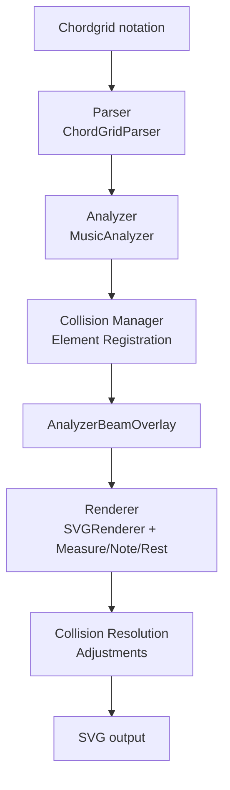

# Chord Grid Plugin for Obsidian

[Français](./README.fr.md)

> Display clean chord grids with precise rhythmic notation rendered as crisp, scalable SVG inside your Obsidian notes.

<!-- Badges (manual style to avoid external services) -->
**Version:** 2.1.0 · **License:** GPL-3.0 · **Status:** Stable

**Latest Release:** [v2.1.0](https://github.com/MathieuCGit/ChordGrid_for_Obsidian/releases/tag/v2.1.0) - **NEW: Collision management system for professional-quality layout**

This plugin parses a lightweight text syntax and turns it into structured musical measures (chords, rhythm groups, ties, rests), then renders them with automatic beaming logic using a clean 3‑stage pipeline: **Parser → Analyzer → Renderer**.

## Installation

### Quick (Recommended via Community Plugins)
1. Open Obsidian → Settings → Community plugins → Browse
2. Search for "Chord Grid" (once published) and install
3. Enable the plugin

### Manual (Developer / Local Build)
1. Create a `chord-grid` folder under `.obsidian/plugins/`
2. Copy / clone repository contents into that folder
3. Install dependencies & build (see Development)
4. Enable in Obsidian: Settings → Community plugins

### Update / Upgrade
Re-run `npm run build` after pulling new changes. If you encounter rendering issues after updating, disable & re-enable the plugin to refresh cached code.

## Usage

In your Obsidian notes, create a fenced code block with the `chordgrid` language:

````markdown
```chordgrid
4/4 ||: Am[88 4 4 88] | C[88 4 4 88] :||
```
````


### Syntax

**Time Signature:** `4/4`, `3/4`, `6/8`, `12/8`, etc.

**Stem Direction (v2.2+):** Control the direction of note stems following musical notation standards
- `stems-up` (default) - Stems point upward (right of notehead, beams above, ties below) - standard for treble clef/solo notation
- `stems-down` - Stems point downward (left of notehead, beams below, ties above) - standard for bass clef/lower voice notation
- Keyword placement: 
  - Separate line before time signature: `stems-down\n4/4`
  - Same line as time signature: `stems-down 4/4`
- Examples:
  ```chordgrid
  stems-down
  4/4 | C[88 4 4] | G[4 4 2] |
  ```
  or
  ```chordgrid
  stems-down 4/4 | C[88 4 4] | G[4 4 2] |
  ```

**Responsive SVG (v2.2+):** All chord grids now render with responsive SVG that automatically adapts to container width while maintaining proper aspect ratio.

**Repeat measures (v2.2+):** Display repeated measures using notation shortcuts
- `%` - Shorthand to repeat the previous measure's rhythm
- `Chord[%]` - Repeat previous rhythm with a new chord
- `show%` directive - Display a visual repeat symbol (%) instead of rendering full rhythm
  - Placement: separate line before time signature or same line
  - Default behavior (no `show%`): rhythm is fully rendered even for repeat measures
  - With `show%`: displays classical measure repeat symbol centered in the measure
- Examples:
  ```chordgrid
  show% 4/4 | C[4 4 4 4] | % | G[%] |
  ```
  or
  ```chordgrid
  show%
  4/4 | Am[88 4 4] | % | Dm[%] |
  ```
  Visual: chord name appears at the start of measure, repeat symbol centered on staff

**Grouping modes (v2.1+):** Control automatic beam grouping behavior
- `4/4 binary` - Force grouping by 2 eighth notes (every 1.0 quarter note)
- `6/8 ternary` - Force grouping by 3 eighth notes (every 1.5 quarter notes)
- `4/4 noauto` - Disable auto-grouping entirely; user controls via spaces
- Default (no keyword) - Auto-detection based on time signature:
  - Binary: denominators ≤ 4 (2/4, 3/4, 4/4, 5/4, etc.)
  - Ternary: denominators ≥ 8 with numerators 3, 6, 9, or 12 (6/8, 9/8, 12/8)
  - Irregular: other meters (5/8, 7/8, 11/8) - no auto-grouping, space-controlled

**Bar lines:**
- `|` : Single bar
- `||` : Double bar end of grid
- `||:` : Start repeat
- `:||` : End repeat
- `:||x3` : End repeat with count (play 3 times total)

**Volta brackets (v2.2+):** Create first/second endings for repeated sections
- `|.1-3` : Start volta bracket for repetitions 1, 2, and 3
- `|.4` : Start volta bracket for repetition 4 (or any single number)
- `|.1,2,3` : Alternative syntax using commas
- `|.` : Explicitly mark the end of a volta bracket (optional)
- Volta brackets automatically span until:
  - The next volta starts (e.g., `|.1-3 ... :||.4`)
  - A repeat start marker `||:` is encountered
  - An explicit end marker `|.` is placed
- Visual appearance:
  - Closed brackets (before `:||`): bracket with hooks on both ends
  - Open brackets (after `:||`): bracket with hook on left only (ending/coda)
- Examples:
  ```chordgrid
  4/4 ||: C[4 4 4 4] |.1-3 G[4 4 4 4] :||.4 Am[4 4 4 4] ||
  ```
  ```chordgrid
  4/4 ||: C[4 88_4 4] | % |.1-3 G[%] | % :||.4 G[4 4 4 4] |. Am[16168 81616 4 88] ||
  ```
  First example: volta 1-3 covers one measure, volta 4 covers one measure
  Second example: volta 1-3 covers two measures before `:||`, volta 4 extends to Am using `|.` marker

**Chords:** Standard notation (e.g., `Am`, `C`, `Gmaj7`, `Dm`, `F#m`, `Bb7`, `C/E`).

**Rhythm in brackets (note values):**
- `1` = Whole note (ronde)
- `2` = Half note (blanche)
- `4` = Quarter note (noire)
- `8` = Eighth note (croche)
- `16` = Sixteenth note (double-croche)
- `32` = Thirty-second note (triple-croche)
- `64` = Sixty-fourth note (quadruple-croche)

**Rests (Silences):**
Add a `-` prefix before any note value to create a rest:
- `-1` = Whole rest (pause)
- `-2` = Half rest (demi-pause)
- `-4` = Quarter rest (soupir)
- `-8` = Eighth rest (demi-soupir)
- `-16` = Sixteenth rest (quart de soupir)
- `-32` = Thirty-second rest
- `-64` = Sixty-fourth rest

Example: `C[4 -4 88_4]` = quarter note, quarter rest, two eighth notes with the last eight note tied to the last quarter note.


> **Important**: Rests break beam groups. For example, `[88-88]` creates two separate beam groups with a rest in between.

**Rhythmic grouping:**
- Numbers grouped together represent one beat (e.g., `88` = 2 eighth notes in the same beat, with connected beams)
- Numbers separated by spaces represent different beaming groups
- Use a simple dot to create dotted notes. For example 4. is a quarter note dotted, 8. is a eight note dotted.

**Ties (Liaisons):**
- Use underscore `_` to create ties between notes
- `_` **after** a note = note starts a tie (sends/emits)
- `_` **before** a note = note receives a tie (receives/ends)
- Examples:
  - `[88_4]` = tie between last eighth note and quarter note
  - `[2 4_88_]` = tie from quarter to two eighths
  - `C[2 4_88_] | [_8]` = tie across measure boundary (last eighth of measure 1 tied to first eighth of measure 2)
  - `{8_8_8}3` = all three notes of triplet tied together
  - `4_{8 8 8}3` = quarter note tied to first note of triplet
  - `{8 8 8_}3 4` = last note of triplet tied to following quarter
  - `| 4_ | {_8 8 8}3 |` = cross-measure tie into tuplet

**Tuplets (v2.1+):**
Tuplets allow grouping notes to play N notes in the time normally occupied by a different number. Syntax: `{notes}N` where N is the tuplet number.

- **Compact notation** (notes together): `{888}3` = triplet with all notes beamed together
- **Spaced notation** (notes separated): `{8 8 8}3` = triplet with independent flags
- **Multi-level beaming**: `{161616 161616}6` = 6 sixteenth notes grouped as 2×3, with level-1 beam connecting all 6, and level-2 beams in two segments
- **Ties within tuplets**: `{8_8_8}3` = triplet with all notes tied
- **Ties crossing tuplet boundaries**: 
  - `4_{8 8 8}3` = quarter tied into tuplet
  - `{8 8 8_}3 4` = tuplet tied to following note
  - `| 4_ | {_8 8 8}3 |` = cross-measure tie into tuplet
- **Complex tie patterns**: `4_{8_8_8}3_4` = continuous tie through entire tuplet

Examples:
- `{888}3` = eighth note triplet (fully beamed)
- `{8 8 8}3` = eighth note triplet (separate flags)
- `{444}3` = quarter note triplet
- `{8 -8 8}3` = triplet with rest in the middle
- `{161616}3` = sixteenth note triplet
- `{161616 161616}6` = sextuplet with advanced multi-level beaming
- `{8_8_8}3` = triplet with all notes tied (legato)
- `{8_8 8}3` = triplet with first two notes tied
- Full measure in 4/4: `| [{888}3 {888}3 {888}3 {888}3] |`

Notes on syntax:
- Use `_` to indicate a tie. Underscores may appear at the end or start of a rhythm group to tie across measures/lines (e.g. `C[2 4_88_] | [_8]`).
- Rests: prefix a value with `-` (e.g. `-4` for a quarter rest). Rests break beam groups.
- Dotted notes use `.` immediately after the number (e.g. `4.`).
- Whitespace influences beaming: placing a space between numbers separates beam groups; a space before a chord token may break a beam group across the chord.

#### Glossary (Quick Reference)
| Term | Meaning |
|------|---------|
| Beat | Logical pulse grouping inside a measure |
| Beam | Horizontal bar connecting stems of short notes (8th or smaller) |
| Beamlet | Partial beam/stub for isolated short notes inside complex groups |
| Tie | Curved line extending a note’s duration into the next note (same pitch implied) |
| Rest | Silence occupying rhythmic duration |
| Segment | Portion of measure tied to one chord symbol |
| Dotted note | Note with trailing `.` increasing duration by 50% |

#### Advanced Syntax Highlights
| Pattern | Effect |
|---------|-------|
| `88` | Two beamed eighths (same beat) |
| `8 8` | Two separate eighths (space splits beams) |
| `4.` | Dotted quarter ( = quarter + eighth ) |
| `16.32` | Beamlet direction adapts (analyzer path) |
| `4_88_ \| [_8]` | Tie across measure boundary |
| `C[8]G[8]` | Cross‑segment beaming if no space (analyzer) |
| `C[8] G[8]` | Space blocks beam |
| `%` | Repeat previous measure's rhythm |
| `Chord[%]` | Repeat rhythm with new chord |
| `show%` | Display visual repeat symbol instead of full rhythm |
| `{888}3` | Eighth note triplet (fully beamed) |
| `{8 8 8}3` | Eighth note triplet (separate flags) |
| `{161616 161616}6` | Sextuplet with multi-level beaming (2×3) |
| `{8_8_8}3` | Triplet with all notes tied together |
| `4_{8 8 8}3` | Quarter note tied to first note of triplet |
| `{8 8 8_}3 4` | Last note of triplet tied to quarter |
| `\| 4_ \| {_8 8 8}3 \|` | Cross-measure tie into tuplet |
| `\|.1-3` | Start volta bracket for endings 1, 2, 3 |
| `:||.4` | End repeat and start volta 4 |
| `\|.` | Explicitly mark end of volta bracket |
| `\|.1,2,3` | Alternative comma syntax for volta |

### Examples

**Simple 4/4 measure:**
```chordgrid
4/4 | G[4 4 4 4] |
```

**Chart with repeats:**
```chordgrid
4/4 ||: Am[88 4 4 88] | Dm[2 4 4] | G[4 4 2] | C[1] :||
```

**Chart with repeat count (v2.2+):**
```chordgrid
4/4 ||: C[4 88_4 4] | % | G[%] | % :||x3
```
The `x3` indicates the section should be played 3 times total.

**Repeat measures with visual symbol (v2.2+):**
```chordgrid
show% 4/4 | C[4 4 4 4] | % | G[%] | Am[88 88] |
```

**Mixed rhythms:**
```chordgrid
4/4 | C[8888 4 4] | G[4 88 4 8] |
```

**Multiple lines:**
```chordgrid
4/4 ||: C[4 4 4 4] | F[4 4 4 4] | G[4 4 4 4] | C[2 2] |
    Am[88 88 4 4] | Dm[4 4 2] | G7[16161616 4 4] | C[1] :||
```

**Chords with dotted notes**
```chordgrid
4/4 | C[4. 8 4 4] | D[8.16 88 4. 8] | Em[168. 4 4 88] | C[16816 4 16168 81616]  |
```

**Chords with rests**
```chordgrid
4/4 | C[4 -4 4 4] | G[-2 4 4] | Am[88 -8 8 4] | F[4 4 -2] |
```

**Volta brackets (first/second endings):**
```chordgrid
4/4 ||: C[4 4 4 4] |.1-3 G[4 4 4 4] :||.4 Am[4 4 4 4] ||
```

**Volta with multiple measures and explicit end:**
```chordgrid
4/4 ||: C[4 88_4 4] | % |.1-3 G[%] | % :||.4 G[4 4 4 4] |. Am[16168 81616 4 88] ||
```
The first ending (1-3) covers 2 measures before the repeat end.
The last ending (4) extends over 2 measures using the `|.` marker to indicate where it ends.

**Tied chords**
```chordgrid
4/4 | C[2 4_88_] | [_8] G[8 4 4 4] | Am[88_4 4 88_] | [_4] Dm[2.] | C[4 4 4_88_] | [_88 4] D[4 4] |
```

**Tuplets (v2.1+)**
```chordgrid
4/4 | C[{888}3 4] | G[{161616}3 {161616}3] | Am[{444}3] | F[{888}3 {888}3 {888}3] |
```

**Tuplets with ties (v2.1+)**
```chordgrid
4/4 | C[{8_8_8}3 4] | G[4_{8 8 8}3] | Am[{8 8 8_}3 4] | F[4_{8_8_8}3_4] |
```

**Cross-measure ties with tuplets (v2.1+)**
```chordgrid
4/4 | C[4 4 4 4_] | D[{_8 8 8}3 4 4 4] | G[4 4 4 4_] | Am[{_8 8 8_}3 _4 4 4] |
```

NOTE: If you want to keep beam grouped by beat take care of space placement. For example
```chordgrid
[_8] G[8 4 4 4]
```
is different from
```chordgrid
[_8]G[8 4 4 4]
```
The space just before the G breaks the beam.

### Troubleshooting
| Symptom | Possible Cause | Fix |
|---------|----------------|-----|
| Measure flagged invalid | Total durations ≠ time signature | Recount values; dotted adds 50% |
| Beam unexpectedly broken | Space or rest present | Remove space / ensure no `-` rest |
| Tie not drawn across line | Analyzer/TieManager pending resolution | Ensure `_` at end & start groups |
| Debug panel absent | Plugin disabled or logger suppressed | Re-enable plugin; check settings |

## Development

### Prerequisites
- Node.js (LTS recommended)
- npm

### Setup
```bash
npm install
npm run dev   # Watch build (esbuild)
npm run build # Production build (type-check + bundle)
```

### Testing
Core parser tests:
```bash
npm test
```
Additional analyzer / integration scripts (run manually):
```bash
ts-node ./test/run_analyzer_tests.ts
ts-node ./test/run_integration_analyzer.ts
```

### Contributing (Summary)
Please see `CONTRIBUTING.md` for full guidelines (style, branching, adding features, test requirements).

### Structure
```
chord-grid/
├── main.ts          # Main plugin code
├── manifest.json    # Plugin metadata
├── package.json     # npm dependencies
└── tsconfig.json    # TypeScript configuration
```

## Features

- ✅ Vector SVG rendering
- ✅ Chord charts with rhythmic notation
- ✅ **Stem direction control** (v2.2.0) – stems-up/stems-down keywords following musical notation standards
- ✅ **Responsive SVG rendering** (v2.2.0) – automatic adaptation to container width with proper aspect ratio
- ✅ **CollisionManager system** (v2.1.0) – intelligent element placement avoiding overlaps
- ✅ **Dynamic time signature spacing** (v2.1.0) – automatic width calculation and adaptive padding
- ✅ **Dotted note collision avoidance** (v2.1.0) – tie curves raised automatically
- ✅ Automatic eighth note beaming by beat (analyzer-driven)
- ✅ **Analyzer-based cross-segment beaming** (v2.0.0) – continuous beams across chord boundaries
- ✅ **Tuplets & complex time signatures** (v2.1.0) – triplets, quintuplets, customizable ratios
- ✅ Repeat bars & barline types
- ✅ Time signature support (12+ signatures: 2/4, 3/4, 4/4, 5/4, 7/4, 5/8, 6/8, 7/8, 9/8, 11/8, 12/8, 15/16)
- ✅ 4 measures per line (automatic, with manual line breaks)
- ✅ Dynamic measure width based on rhythmic density
- ✅ Dotted notes, ties, rests
- ✅ **Inline Debug Logger** (v1.1.0) – collapsible debug panel
- ✅ **Improved beam rendering** for complex rhythmic patterns with multi-level support
- 🚧 Planned: grace notes, articulations, dynamics, export formats

## Debugging

The plugin includes a built-in debug logger that displays detailed information directly in your notes. Click on "🐛 Debug Logs" above any chord grid to see:

- Parsing steps and results
- Layout calculations
- Beam detection and rendering
- Tie detection and matching
- Note positions and properties

For more information, see [DEBUG_LOGGER.md](DEBUG_LOGGER.md).

## Current Limitations

- No dynamics, articulations, grace notes yet
- No export to PDF/PNG/MIDI yet
- Complex time signatures under implementation

### Roadmap (High Level)
| Milestone | Highlights |
|-----------|-----------|
| v1.x Maintenance | Stability, bug fixes, doc polish |
| v2.0 Analyzer Core | ✅ Full Parser → Analyzer → Renderer separation, unified beaming |
| v2.1 Tuplets & Collision Management | ✅ Complete tuplet implementation (triplets, quintuplets, customizable ratios), complex time signatures (12+), intelligent collision avoidance system |
| v2.2 Stem Direction & Responsive SVG | ✅ Musical notation standards (stems-up/stems-down), responsive SVG rendering |
| v2.3 Grace Notes & Ornaments | Extend duration model for grace notes and musical ornaments |
| v2.4 Dynamics & Articulation | Symbol layer, extensible rendering decorators |
| v2.5 Export Layer | PNG / SVG clean export + optional MIDI proof-of-concept |
| v3.0 Interactive Editing | In-note editing handles, real-time validation |

## Architecture (v2.2 – ✅ Complete with Stem Direction Control)

The rendering pipeline uses a clean 3-stage architecture with intelligent collision detection and proper musical notation standards:

1. **Parser** (`ChordGridParser`) – Performs syntactic parsing of the chord grid into structured measures and segments (tokens, rhythm groups, ties, rests, whitespace awareness, tuplets).
2. **Analyzer** (`MusicAnalyzer`) – Computes musical semantics, especially beam groups that may span chord segment boundaries. Produces `BeamGroup[]` with `NoteReference` entries pointing back to parsed notes.
3. **Renderer** (`SVGRenderer` + sub-renderers) – Draws notes/stems/ties and uses analyzer-driven beams for proper cross-segment beaming. **CollisionManager** ensures intelligent element placement.

#### Key Components (v2.1)

**CollisionManager**: Central system managing spatial conflicts between rendered elements
- Tracks bounding boxes for all visual elements (chords, notes, stems, tuplets, rests, time signatures, dots, ties)
- Priority-based resolution (fixed elements vs. mobile elements)
- Collision detection using axis-aligned bounding boxes (AABB) with configurable margins
- `findFreePosition()` algorithm with spiral search pattern
- Smart positioning for tuplet numbers, chord symbols, and tie curves
- Automatic adjustment: tie curves raised when overlapping dotted note dots

**Dynamic Spacing**: Adaptive layout system
- Time signature width calculated based on content (numerator/denominator length)
- Responsive left padding prevents overlap with first measure
- Measure widths computed from rhythmic density (more notes = wider measure)
- Tighter, more professional spacing (factor 0.53, margin 4px)

#### Mermaid diagram



### Why the analyzer?
Previously, beams could not cross chord boundaries even when musically continuous (e.g. `[8]G[8]`). The analyzer flattens measure notes, respects rests and whitespace, and builds multi‑level beam groups (8/16/32/64) including correct beamlet direction for dotted values.

### Why the CollisionManager?
Professional music notation requires precise spacing to avoid visual conflicts. The CollisionManager:
- Prevents time signatures from overlapping the first measure
- Positions tuplet numbers above chord symbols automatically
- Adjusts tie curves to avoid dotted note dots
- Maintains clean, readable layouts across all rhythmic densities
- Enables future enhancements (dynamics, articulations) without manual spacing

### Cross-segment beaming examples

```chordgrid
4/4 | C[8]G[8] Am[88 4 4] |
```
The two isolated eighths before the space will beam together if there is no space between `]G[`.

```chordgrid
4/4 | C[8] G[8] Am[88 4 4] |
```
Here the space before `G` breaks the beam, producing two separate single stems.

### Planned next steps
* Comprehensive documentation for CollisionManager API
* Performance profiling for large grids (100+ measures)
* Extend collision system for dynamics and articulations
* Grace notes with duration model extension
* Snapshot tests for SVG rendering consistency
* Export hooks (PNG/PDF/MIDI)

## License

Licensed under **GNU GPL-3.0**. See `LICENSE` for full text. (The `package.json` has been aligned to GPL-3.0.)
