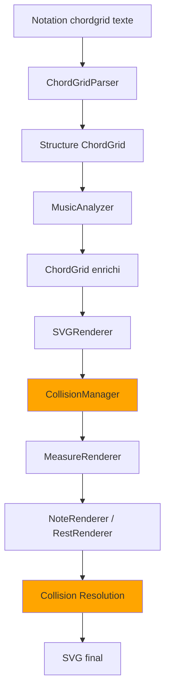

# Architecture du Plugin Chord Grid

## Vue d'ensemble

Ce plugin Obsidian (version 2.1.0) permet de rendre des grilles d'accords avec notation rythmique en SVG. Il est composé de quatre modules principaux : **Parsing**, **Analyse**, **Modèles**, et **Rendu**. La version 2.1.0 introduit un système complet de gestion des collisions pour un rendu optimal et automatique des éléments visuels.

## Structure du projet

```
ChordGrid_for_Obsidian/
├── main.ts                          # Point d'entrée du plugin Obsidian
├── manifest.json                    # Manifeste du plugin
├── package.json                     # Dépendances & scripts
├── esbuild.config.mjs               # Configuration de build
├── jest.config.js                   # Configuration des tests
├── styles.css                       # Styles du plugin
├── README.md                        # Documentation utilisateur (anglais)
├── README.fr.md                     # Documentation utilisateur (français)
├── LICENSE                          # Licence MIT
├── documentation/                   # Documentation technique
│   ├── README.md                    # Index de la documentation
│   ├── ARCHITECTURE.md              # Architecture (anglais)
│   ├── ARCHITECTURE_[Fr].md         # Ce fichier (français)
│   ├── CHANGELOG.md                 # Historique des versions
│   ├── CONTRIBUTING.md              # Guide de contribution
│   ├── DEBUG_IMPLEMENTATION*.md     # Guides système de debug
│   ├── DEBUG_LOGGER*.md             # Documentation du logger
│   ├── TUPLET_RATIOS*.md            # Système de ratios tuplets
│   ├── MIXED_TUPLETS.md             # Tuplets mixtes (baseLen)
│   ├── GROUPING_CONVENTIONS.md      # Groupement binary/ternary
│   └── release_notes_v2.1.0.md      # Notes de version
├── src/
│   ├── parser/                      # Module de parsing
│   │   ├── ChordGridParser.ts       # Parser principal
│   │   └── type.ts                  # Définitions de types
│   ├── analyzer/                    # Module d'analyse musicale
│   │   ├── MusicAnalyzer.ts         # Analyseur principal
│   │   └── analyzer-types.ts        # Types d'analyse
│   ├── models/                      # Modèles de données
│   │   ├── Beat.ts                  # Modèle Beat
│   │   ├── Measure.ts               # Modèle Measure
│   │   ├── Note.ts                  # Modèle Note
│   │   └── TimeSignature.ts         # Modèle TimeSignature
│   ├── renderer/                    # Module de rendu SVG
│   │   ├── SVGRenderer.ts           # Renderer principal
│   │   ├── MeasureRenderer.ts       # Rendu de mesures
│   │   ├── NoteRenderer.ts          # Rendu de notes
│   │   ├── RestRenderer.ts          # Rendu de silences
│   │   ├── BeamRenderer.ts          # Rendu des ligatures
│   │   ├── AnalyzerBeamOverlay.ts   # Overlay ligatures analysées
│   │   ├── ChordRenderer.ts         # Rendu des symboles d'accords
│   │   ├── PlaceAndSizeManager.ts   # Gestion placement & collisions
│   │   └── constants.ts             # Constantes SVG
│   └── utils/
│       ├── TieManager.ts            # Gestion liaisons cross-mesure
│       └── DebugLogger.ts           # Logs de débogage
└── test/                            # Tests unitaires (40 fichiers, 275 tests)
    ├── *.spec.ts                    # Fichiers de test Jest
    ├── analyzer.spec.ts             # Tests analyseur
    ├── beam_*.spec.ts               # Tests ligatures
    ├── chord_*.spec.ts              # Tests rendu d'accords
    ├── tie_*.spec.ts                # Tests liaisons
    ├── tuplet_*.spec.ts             # Tests tuplets
    ├── repeat_*.spec.ts             # Tests notation répétition
    ├── volta_*.spec.ts              # Tests crochets volta
    └── ...                          # Tests parser, renderer
```

## Flux de données

```
Entrée texte (notation chordgrid)
         ↓
   ChordGridParser (tokenisation, parsing)
         ↓
    ChordGrid (structure de données)
         ↓
   MusicAnalyzer (analyse des ligatures)
         ↓
  ChordGrid enrichi (avec BeamGroup[])
         ↓
    SVGRenderer (initialisation)
         ↓
  CollisionManager (enregistrement des éléments)
         ↓
  MeasureRenderer + NoteRenderer + RestRenderer
         ↓
  Collision Resolution (ajustements automatiques)
         ↓
   Élément SVG (sortie finale)
```



## Module Parser

### ChordGridParser

**Responsabilités :**
- Parse la notation textuelle en structures de données
- Valide la durée des mesures par rapport à la signature temporelle
- Analyse les ligatures et liaisons
- Gère les sauts de ligne et le regroupement des mesures

**Syntaxe supportée :**
- Signatures temporelles : `4/4`, `3/4`, `6/8`, `C`, `C|`
- Barres : `|` (simple), `||` (double), `||:` (reprise début), `:||` (reprise fin)
- Accords : notation standard (Am, C7, Gmaj7, F#m, Bb7, etc.)
- Notes : 1, 2, 4, 8, 16, 32, 64
- Notes pointées : `4.`, `8.`, etc.
- Silences : `-4`, `-8`, etc.
- Liaisons : `_` (ex: `4_88_` ou `[_8]`)
- Ligatures : notes groupées sans espace (ex: `88` = 2 croches liées)

**Algorithme de parsing :**
1. Extraction de la signature temporelle (première ligne)
2. Tokenisation par barres de mesure
3. Parsing de chaque mesure :
   - Extraction des accords et rythmes
   - Création des beats et notes
   - Analyse des ligatures (BeamAndTieAnalyzer)
   - Détection des liaisons
4. Validation des durées
5. Regroupement en lignes de rendu

### BeamAndTieAnalyzer

**Responsabilités :**
- Analyser les groupes rythmiques
- Déterminer les ligatures entre notes
- Gérer les liaisons (ties) entre notes, mesures et lignes

**Règles de ligature :**
- Notes >= 8 (croches) peuvent être liées
- Silences brisent les ligatures
- Espace dans la notation sépare les groupes
- Minimum 2 notes pour former un groupe

**Règles de liaison :**
- `_` marque une liaison
- Liaisons peuvent traverser mesures et lignes
- `tieToVoid` : liaison vers note virtuelle (fin ligne)
- `tieFromVoid` : liaison depuis note virtuelle (début ligne)

## Module Analyzer

### MusicAnalyzer

**Responsabilités :**
- Analyser la structure musicale des mesures
- Identifier les groupes de ligatures (BeamGroup)
- Enrichir la structure ChordGrid avec métadonnées d'analyse
- Support des tuplets avec ratios personnalisables

**Algorithme d'analyse :**
1. Parcourir toutes les mesures de la grille
2. Identifier les séquences de notes ligaturables (valeur >= 8)
3. Respecter les séparations d'espace (breaks de ligature)
4. Détecter les tuplets et calculer leurs ratios effectifs
5. Créer les BeamGroup avec positions précises

**Support des tuplets :**
- Syntaxe : `(N:M notes)` où N = notes jouées, M = notes théoriques
- Ratios par défaut : (3:2), (5:4), (6:4), (7:4), (9:8)
- Ratios explicites supportés : `(5:6 notes)`, `(7:8 notes)`, etc.
- Validation de durée : durée totale des notes doit correspondre au ratio
- Affichage automatique du ratio dans le rendu SVG

## Module Modèles

### Hiérarchie des structures

```
ChordGrid
  ├── TimeSignature
  └── Measure[]
       ├── ChordSegment[]
       │    ├── chord (string)
       │    └── Beat[]
       │         └── Note[]
       └── barline (BarlineType)
```

### Note
- **Propriétés rythmiques** : value, dotted, isRest
- **Propriétés de liaison** : tieStart, tieEnd, tieToVoid, tieFromVoid
- **Méthode clé** : `durationInQuarterNotes()` - calcul de durée

### Beat
- Contient un tableau de notes/silences
- **Méthodes clés** : 
  - `totalQuarterNotes()` - somme des durées des notes

### Measure
- Contient les beats et métadonnées
- Support de changements d'accords multiples via `chordSegments`
- **Méthodes clés** :
  - `totalQuarterNotes()` - durée totale de la mesure

### TimeSignature
- Parsing et validation de signatures temporelles
- Calculs de durée et tempo
- Détection de mesures composées

## Module Renderer

### Architecture de rendu

```
SVGRenderer (orchestration)
    ↓
CollisionManager (gestion des collisions)
    ↓
MeasureRenderer (par mesure)
    ↓
NoteRenderer / RestRenderer (par note)
```

### SVGRenderer

**Responsabilités :**
- Calculer la taille globale du SVG avec espacement dynamique
- Positionner les mesures sur la grille (4 par ligne, adaptatif)
- Gérer les sauts de ligne (automatiques et manuels)
- Initialiser CollisionManager et TieManager
- Calculer largeur dynamique de la signature rythmique
- Dessiner les liaisons entre mesures avec évitement de collision
- Appliquer ajustements de collision (courbes de liaison, numéros de tuplets)

**Paramètres de layout :**
- `measuresPerLine` : 4 (défaut)
- `baseMeasureWidth` : 240px (minimum, ajusté dynamiquement selon densité rythmique)
- `measureHeight` : 120px
- Espacement entre lignes : 20px
- Padding gauche dynamique : calculé selon largeur signature rythmique
- Facteur espacement signature : 0.53 (v2.1.0, optimisé)
- Marge signature : 4px (v2.1.0, optimisé)

### CollisionManager

**Responsabilités :**
- Enregistrer tous les éléments visuels avec leurs bounding boxes
- Détecter les collisions potentielles entre éléments
- Résoudre conflits spatiaux via repositionnement intelligent
- Suggérer positions alternatives pour éléments mobiles
- Gérer priorités (éléments fixes vs mobiles)

**Types d'éléments gérés :**
- `chord` : symboles d'accords
- `time-signature` : indications de mesure
- `note` : têtes de notes
- `stem` : hampes
- `beam` : barres de ligature
- `tie` : liaisons
- `tuplet-bracket` : crochets de tuplets
- `tuplet-number` : numéros/ratios de tuplets
- `rest` : silences
- `barline` : barres de mesure
- `staff-line` : lignes de portée
- `dot` : points de notes pointées (v2.1.0)

**Algorithmes de résolution :**
- `hasCollision()` : détection AABB (Axis-Aligned Bounding Box) avec marges configurables
- `findFreePosition()` : recherche en spirale pour position libre
  - Directions : vertical, horizontal, both
  - Tentatives max : 20 par défaut
  - Step : `minSpacing + 2`
- `suggestVerticalOffset()` : ajustement vertical spécifique par paire de types
- Système de priorités : 0 = fixe (ne bouge pas), 10 = mobile (peut être déplacé)

**Cas d'usage spécifiques (v2.1.0) :**
- Signature rythmique vs première mesure : padding gauche ajusté automatiquement
- Numéros de tuplets vs accords : décalage vertical via `findFreePosition`
- Points de notes pointées vs courbes de liaison : courbe relevée (controlY ajusté)

### MeasureRenderer

**Responsabilités :**
- Dessiner barres de mesure (simple, double, reprises)
- Dessiner ligne de portée
- Positionner les accords avec évitement de collision
- Répartir l'espace entre beats
- Gérer séparations visuelles entre segments
- Enregistrer tous éléments visuels dans CollisionManager (v2.1.0)

**Éléments enregistrés dans CollisionManager :**
- Symboles d'accords avec bbox calculé selon longueur texte
- Têtes de notes (noteheads)
- Hampes (stems) avec direction (up/down)
- Barres de ligature (beams) multi-notes
- Crochets et numéros de tuplets
- Silences de toutes durées
- Points de notes pointées (4x4px, priorité 9, v2.1.0)

**Positionnement des accords :**
- Position initiale : (measureX + noteX, staffY - 30)
- Si collision détectée : `CollisionManager.findFreePosition('vertical')` appliqué
- Position finale ajustée pour éviter overlap

**Algorithme de layout :**
1. Calculer espace disponible (en soustrayant `extraLeftPadding` pour barlines de reprise)
2. Allouer espace proportionnellement aux beats
3. Insérer séparateurs pour changements d'accords
4. Rendre chaque segment avec NoteRenderer
5. Enregistrer éléments dans CollisionManager au fur et à mesure

**Gestion de l'espace pour barlines de reprise (v2.2.1) :**
- `extraLeftPadding` est calculé pour barlines `||:` (8px: 3px + 6px + 1.5px - 2.5px)
- Cet espace est soustrait de `availableForBeatCells` pour éviter débordement des notes
- Garantit que les notes restent dans les limites de la mesure même avec layouts compressés (`measures-per-line`)

### NoteRenderer

**Responsabilités :**
- Dessiner têtes de notes (slash notation)
- Dessiner hampes (stems)
- Dessiner crochets individuels (flags)
- Dessiner ligatures multi-niveaux (beams)
- Gérer notes pointées

**Niveaux de ligature :**
- Croche (8) : 1 niveau
- Double-croche (16) : 2 niveaux
- Triple-croche (32) : 3 niveaux
- Quadruple-croche (64) : 4 niveaux

### RestRenderer

**Responsabilités :**
- Dessiner tous types de silences
- Gérer silences pointés
- Enregistrer bounding boxes dans CollisionManager (v2.1.0)

**Types de silences :**
- Pause (1) : rectangle suspendu
- Demi-pause (2) : rectangle posé
- Soupir (4) : forme Z stylisée
- Demi-soupir (8) : crochet simple
- Quart de soupir (16) : double crochet
- Etc.

**Enregistrement collision (v2.1.0) :**
- Chaque silence enregistré avec bbox approprié
- Permet évitement par autres éléments (accords, tuplets, liaisons)

### TieManager

**Responsabilités :**
- Gérer liaisons traversant limites de rendu
- Stocker liaisons "en attente" (pending)
- Résoudre liaisons cross-ligne
- Coordonner avec CollisionManager pour évitement (v2.1.0)

**Workflow :**
1. Note avec `tieToVoid` → `addPendingTie()`
2. Rendu ligne suivante
3. Note avec `tieFromVoid` → `resolvePendingFor()`
4. Dessiner courbe de liaison entre les positions
5. Ajuster controlY si collision détectée avec points de notes pointées (v2.1.0)

**Détection et évitement de collision (v2.1.0) :**
- Avant dessin, vérifier collision entre bbox de liaison et points de notes pointées
- Si collision détectée : relever courbe (augmenter controlY)
- Algorithme : `controlY_new = baseY - max(6, baseAmplitude * 0.6)`
- Enregistrer bbox de liaison dans CollisionManager après ajustement

## Validation et erreurs

### ValidationError

Structure d'erreur générée lors de la validation des mesures :
- `measureIndex` : position de la mesure (0-based)
- `expectedQuarterNotes` : durée attendue selon signature temporelle
- `foundQuarterNotes` : durée réelle trouvée
- `message` : description de l'erreur

### Calcul de durée attendue

```typescript
expectedQuarterNotes = numerator * (4 / denominator)
```

Exemples :
- 4/4 → 4 * (4/4) = 4 quarter-notes
- 3/4 → 3 * (4/4) = 3 quarter-notes
- 6/8 → 6 * (4/8) = 3 quarter-notes
- 12/8 → 12 * (4/8) = 6 quarter-notes

## Gestion des espaces

Les espaces dans la notation source ont une signification :

### Dans les groupes rythmiques
```
[88 4 4]    // 2 beats : [88] et [4 4]
[8888]      // 1 beat : [8888]
```

### Entre accords
```
Am[88 4] G[4 88]    // Pas de séparation visuelle
Am[88 4] G[4 88]   // Séparation visuelle (espace avant G)
```

## Patterns de conception

### Factory Pattern
Les modèles (Note, Beat, Measure) acceptent des données partielles et initialisent avec des valeurs par défaut.

### Builder Pattern
Le parser construit progressivement la structure ChordGrid en accumulant les mesures.

### Strategy Pattern
Différents renderers (NoteRenderer, RestRenderer) pour différents types d'éléments.

### Observer Pattern
Le TieManager observe les notes avec liaisons et résout les références cross-mesure.

## Extension future

### Points d'extension possibles :
1. **Nouveaux types de notation** : ajouter des handlers dans ChordGridParser
2. **Styles de rendu alternatifs** : créer des renderers alternatifs implémentant l'interface commune
3. **Export** : ajouter des méthodes dans les renderers pour export PNG/PDF
4. **Audio** : intégrer un moteur audio pour lecture des grilles
5. **Édition interactive** : ajouter des handlers d'événements sur les éléments SVG

### Ajout d'un nouveau type de note :

1. Ajouter la valeur dans `NoteValue` type (type.ts)
2. Implémenter le rendu dans `NoteRenderer` ou `RestRenderer`
3. Mettre à jour `getBeamCount()` si nécessaire
4. Ajouter tests dans `beam_parse.spec.ts`

### Ajout d'un nouveau type de barre :

1. Ajouter l'entrée dans `BarlineType` enum (type.ts)
2. Mettre à jour la regex de tokenisation dans `ChordGridParser`
3. Implémenter le rendu dans `MeasureRenderer.drawBar()`

## Tests

Les tests sont organisés par fonctionnalité :
- `parse.spec.ts` : tests de parsing général
- `beam_parse.spec.ts` : tests de ligatures
- `beam_render.test.ts` : tests de rendu de ligatures
- `debug_*.ts` : scripts de débogage

### Lancer les tests :
```bash
npm test
```

## Performance

### Optimisations actuelles :
- Calcul de durée en cache dans les modèles
- Création d'éléments SVG natives (pas de bibliothèque)
- Regroupement de mesures pour réduire les calculs de layout

### Métriques cibles :
- Parse < 10ms pour grille de 16 mesures
- Rendu < 50ms pour grille de 16 mesures
- Mémoire < 5MB pour grille complète en mémoire

## Dépendances

- **Obsidian API** : intégration avec Obsidian
- **TypeScript** : typage statique
- **ESBuild** : compilation rapide
- Aucune dépendance externe pour le rendu (SVG natif)

## Contribution

Pour contribuer au projet :
1. Consulter cette documentation
2. Lire les commentaires JSDoc dans le code
3. Ajouter des tests pour nouvelles fonctionnalités
4. Maintenir la cohérence de style (voir conventions ci-dessous)

### Conventions de code :
- Classes en PascalCase
- Méthodes/propriétés en camelCase
- Constantes en UPPER_SNAKE_CASE
- Interfaces préfixées avec `I` si nécessaire
- Documentation JSDoc pour toutes les API publiques

---

**Dernière mise à jour** : 11 novembre 2025  
**Version** : 1.0.0  
**Auteur** : MathieuCGit
